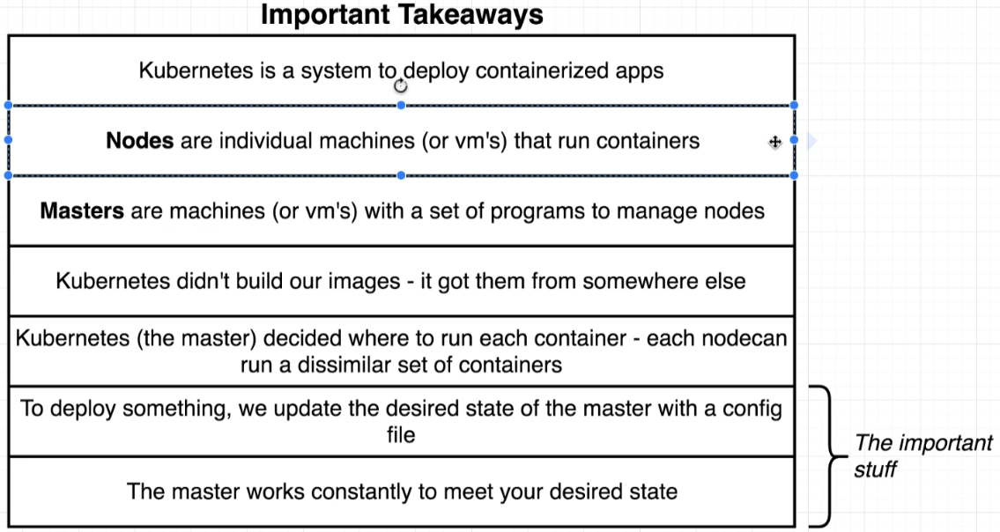
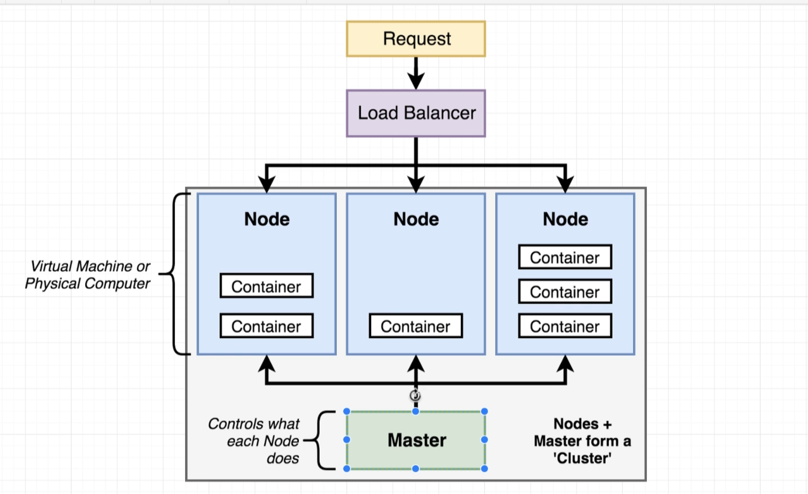

# Kubernetes #
* System for running container over many different machines
* Helps scale/orchestrates containers
* Expected the images are already built
* Networking has to be manually set up
* Config files are used to create Kubernetes objects

# Kubernetes Objects #
* apiVersions determine what object types you can access.    
* v1
    *-* Pod
    *-* configMap
    *-* Event
    *-* componentStatus
    *-* Endpoints
    *-* Namespace
* apps/v1
    - ControllerRevision
    - StatefulSet

# Cluster Composition #

## Nodes 
* Physical or Virtual Machines
* can contain and run multiple containers (possibly of different types)

## Master
* Manages what each node runs at any given time in a cluster
* Works constantly to meet your desired state
* To deploy something, we update the desired state of the master with a config file

## Kube-Proxy
* Entry/Exit point in the cluster to the external world

## Load Balancer
* Exists outside of the cluster
* Relays request to specific nodes

# Kubernetes Environments
* Use Minikube or Kind in Devleopment
* Managed Environments are using in Production such as EKS or GKe

# Managing Kubernetes
## Minikube
* Manages the Kubernetes cluster in the local machine

## kubectl
* Use for managing the containers in the node by interacting with Master

# Docker Compose vs Kubernetes #
* Kubernetes expects all images to be built
* One config file per object we want to create
* Have to manually set up all networking