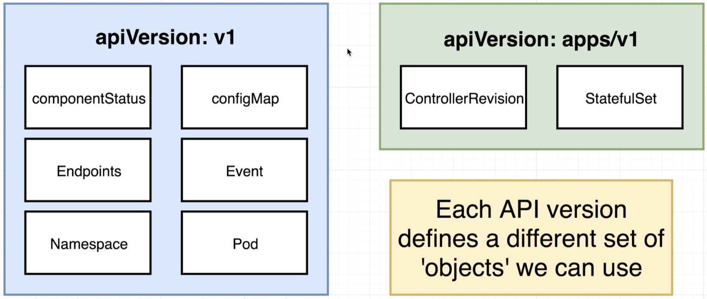
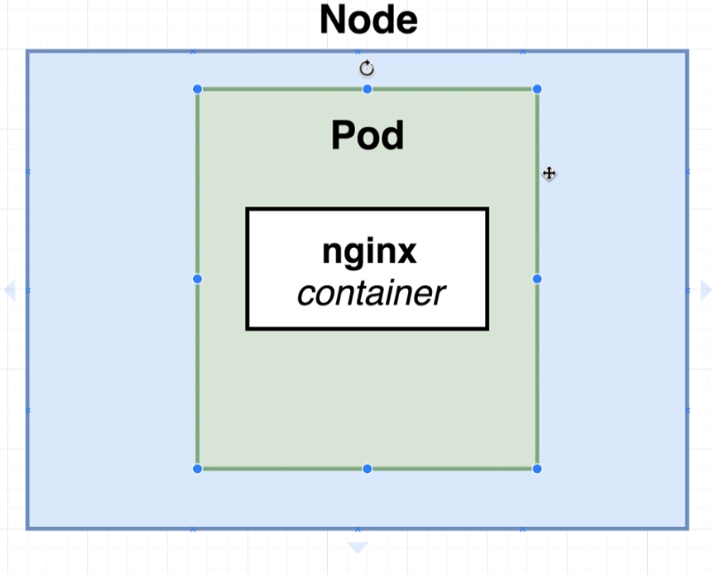
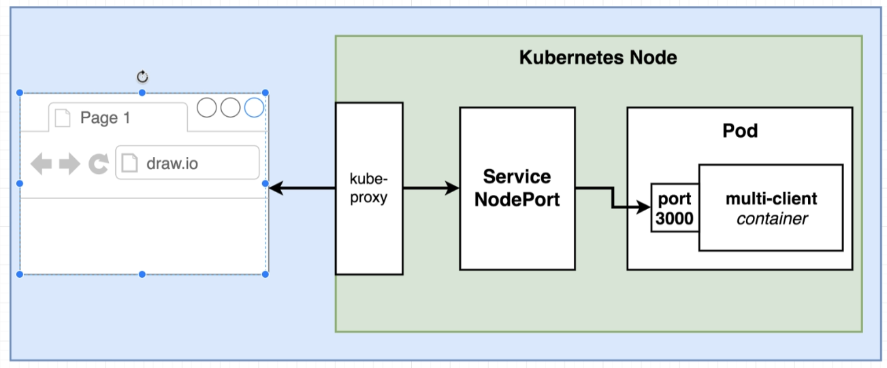

# Configs and Objects
* Configuration files are used to create Kubernetes Object Types such as
  * StatefulSet, ReplicalController, Pod, Service

# Kind
```
apiVersion: 1
kind: Service | Pod | ...
```



* To determine what api version to use, you have to first know what object type you want to create and then lookup the api version group that contains the object type.

# Metadata
```
metadata:
  name: client-pod
  labels:   
    # Identifies the pod in the label selector system of Kubernetes (component is arbitrary key-value pair)
    component: web
    tier: frontend
```
* 'Name' is mostly used for logging purposes
* Objects (such as services) can use the labels to apply itself to an object (or pod in this case)


# Pods
```
apiVersion: v1
kind: Pod
spec:
  containers:    
      # referenceable name for networking or other containers within the pod
    - name: client 
      image: stephengrider/multi-client
      ports:
        # Port exposed to the outside world
        # Can't be changed after deployed
        - containerPort: 3000
```
* Smallest unit of deployment
* Used to group one or more containers with a common purpose that runs within a node
* Not used in production alone.  Used in conjunction with a Deployment.
* The pod be accessed directly because it might not be in a good state
* If you have multiple containers within a pod, it typically means that these containers cannot run without each other.
* An example of a pod with multiple containers:
    * Microservice Container
    * Logger (Sidecar)
    * Event Publisher (Sidecar)




# Service
* Sets up networking in a Kubernetes Cluster
* Sub Types:
  * NodePort - exposes a port to the outside world.  Good only for development.
  * ClusterIP
  * LoadBalancer
  * Ingress
* Use selectors to redirect traffic to a particular object with the configured key-value pair label metadata

## Example
```
apiVersion: v1
kind: Service
metadata:
  name: client-node-port
spec:
  type: NodePort
  ports:          
    - # Port that another Pod or another container within a Pod can use to connect to the target port
      port: 3050 
      # Container Port
      targetPort: 3000 
      # Port accessible by the outside world / browser. Random if not specified (30000-32767).
      nodePort: 31515
  selector:
    # Redirect all traffic from ports above to objects with the following label
    component: web
```
* The highly specific port assignments is one of the reasons why this is not ideal for a Production deployment



# Deployment
- Maintains a set of identical pods, ensuring that they have the correct config and that the right number exists

```

```